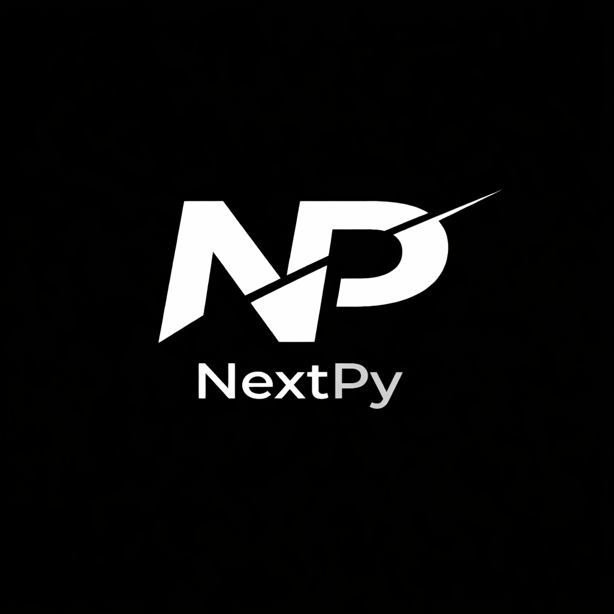

<div align="center">




# NextPy Framework

### The Full-Stack Python Framework


Build modern web applications using Python, PSX, file-based routing, server-side rendering, static generation, React-style hooks, and integrated AI development tools.

[Documentation](https://nextpy.dev) •
[Examples](https://nextpy.dev/examples) •
[Discord](https://discord.gg/nextpy) •
[GitHub Discussions](https://github.com/RahimStudios/nextpy/discussions)

</div


---

## Getting Started

NextPy is a Python-first full-stack framework inspired by the developer experience of Next.js while introducing powerful innovations such as:

* PSX (Python Syntax Extension)
* File-based routing
* Server-side rendering (SSR)
* Static site generation (SSG)
* API routes
* React-style hooks in Python
* Built-in AI coding assistant
* Modern CLI tooling
* Enterprise-ready architecture

### Installation

```bash
pip install nextpy-framework
```

### Create a Project

```bash
nextpy create my-app
cd my-app
nextpy dev
```

Visit:

```text
http://localhost:8000
```

---

## Why NextPy?

### Python First

Build full-stack applications without switching languages.

### PSX

Write component-based user interfaces using NextPy's Python Syntax Extension.

### AI Native

NextPy includes an integrated AI coding assistant:

```bash
nextpy ai
```

Chat mode:

```bash
nextpy ai chatbot
```

Agent mode:

```bash
nextpy ai agent
```

Generate complete applications:

```bash
nextpy ai create ecommerce app
```

### Full-Stack by Default

* Frontend
* Backend
* API Routes
* Database Integration
* Authentication
* Deployment

Everything in one framework.

---

## Example

```python
from nextpy import component, useState

@component
def Home():
    [count, setCount] = useState(0)

    return (
        <div>
            <h1>Welcome to NextPy</h1>

            <button onclick={lambda e: setCount(count + 1)}>
                Count: {count}
            </button>
        </div>
    )

default = Home
```

---

## Documentation

Visit the official documentation:

https://nextpy.dev/docs

Documentation includes:

* Getting Started
* Routing
* PSX
* Components
* Hooks
* Data Fetching
* API Routes
* Deployment
* AI Assistant
* CLI Reference

---

## Community

The NextPy community can be found on GitHub Discussions where you can ask questions, share projects, suggest features, and connect with other developers.

* GitHub Discussions
* Discord Community
* X (Twitter)
* YouTube

Please read and follow our Code of Conduct when participating in community spaces.

---

## Contributing

Contributions are welcome and greatly appreciated.

Before contributing, please read:

* Contribution Guidelines
* Code of Conduct

Good first issues are available for new contributors looking to get involved.

---

## Security

If you discover a security vulnerability, please do not create a public issue.

Instead, contact:

[security@rahimstudios.com](mailto:security@rahimstudios.com)

We will investigate and respond as quickly as possible.

---

## License

Licensed under the MIT License.

---

<div align="center">

### Built with ❤️ by RahimStudios

The future of AI-native Python development.

</div>
